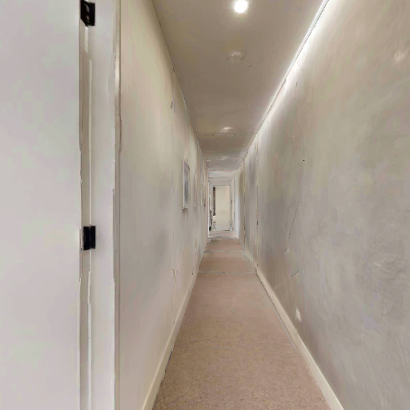
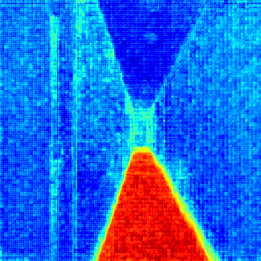

# SAM for Traversability Prediction (SAM-TP)

This repository provides inference and visualization code for **SAM-TP**, a customized version of SAM2 tailored for pixel-wise traversability prediction. SAM-TP is the perception core of [GeNIE: A Generalizable Navigation System for In-the-Wild Environments](https://arxiv.org/abs/2506.17960), where it enables robust terrain understanding across diverse environments.


### 📄 Paper

**GeNIE: A Generalizable Navigation System for In-the-Wild Environments**

[Jiaming Wang*](), [Diwen Liu*](), [Jizhuo Chen*](), [Jiaxuan Da](), [Nuowen Qian](), [Tram Minh Man](), [Harold Soh](https://haroldsoh.com/)

**Paper link**: [https://arxiv.org/abs/2506.17960](https://arxiv.org/abs/2506.17960)

Got it! Here's the updated **Setup** section without the `conda create` and `conda activate` part — focusing purely on the `pip install -e .` method:

---

## 🔧 Setup

### 1. Install dependencies and the package

Run the following command in the root directory to install all required dependencies and the package in editable mode:

```bash
pip install -e .
```

### 2. Install PyTorch manually

PyTorch is excluded so you can install the version that matches your system’s CUDA/GPU setup.

For example, for the **nightly build with CUDA 12.8**, run:

```bash
pip install --pre torch torchvision torchaudio --index-url https://download.pytorch.org/whl/nightly/cu128
```

> 🔗 Visit [https://pytorch.org/get-started/locally/](https://pytorch.org/get-started/locally/) to find the correct install command for your setup.

---

## 📦 Model Configuration and Checkpoint

The script uses the following paths:

* Model config:
  `sam2/configs/sam2.1_inference_tiny/sam2.1_custom2.yaml`
* Checkpoint:
  `sam2_logs/configs/sam2.1_training_tiny/sam2_training_custom2_freezeNoneNone_f57.yaml/checkpoints/checkpoint_2.pt`
  
🔔 Note: The checkpoint file is not included in the repository.
To use the model, please download the checkpoint manually from the link below and place it in the expected directory.

### 📥 Download Checkpoint

Manually download the model checkpoint from:

🔗 [Google Drive – SAM2 Checkpoint](https://drive.google.com/drive/folders/190yHH-TcfQVoByZeB1809sPIR62CsBD1?dmr=1&ec=wgc-drive-hero-goto)

Then place the `checkpoint_2.pt` file at the following location:

```
sam2_logs/configs/sam2.1_training_tiny/sam2_training_custom2_freezeNoneNone_f57.yaml/checkpoints/checkpoint_2.pt
```

---

### ✅ Usage

```bash
python visualize_heatmap.py \
  --input_path /path/to/image.jpg \
  --output_dir /path/to/output/
```

* `--input_path`: Path to the input image (JPG or PNG)
* `--output_dir`: Directory where the output heatmap and score map will be saved

---
Great! You can include the two images side by side (or stacked, depending on your preference) in the `README.md` using standard Markdown image syntax. Assuming they’re located at `example/0001.jpeg` and `example/heatmap.jpg` in your repo, here’s how you can do it:

---

### 🧪 Example Inference Output

We run **SAM-TP** on an input image to predict traversable areas. The result is visualized as a color-coded heatmap, where:

> 🔴 **Red** regions are **easier to navigate**
> 🔵 **Blue** regions are **harder to navigate**

<div align="center">

<table>
  <tr>
    <td align="center"><strong>Input Image</strong></td>
    <td align="center"><strong>Traversability Heatmap</strong></td>
  </tr>
  <tr>
    <td></td>
    <td></td>
  </tr>
</table>

</div>

---


### 🔖 Citation

If you use **SAM-TP** or the **GeNIE system** in your research, please cite our paper:

**[GeNIE: A Generalizable Navigation System for In-the-Wild Environments](https://arxiv.org/abs/2506.17960)**
Jiaming Wang\*, Diwen Liu\*, Jizhuo Chen\*, Jiaxuan Da, Nuowen Qian, Tram Minh Man, Harold Soh

```bibtex
@article{wang2024genie,
  title={GeNIE: A Generalizable Navigation System for In-the-Wild Environments},
  author={Wang, Jiaming and Liu, Diwen and Chen, Jizhuo and Da, Jiaxuan and Qian, Nuowen and Man, Tram Minh and Soh, Harold},
  journal={arXiv preprint arXiv:2506.17960},
  year={2024}
}
```


---
